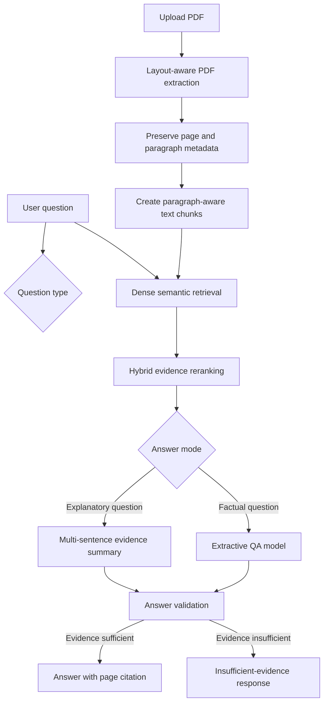
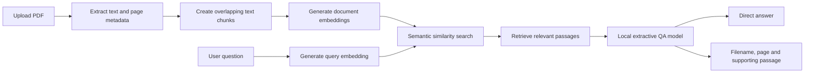

# Academic Research Assistant


A local, evidence-grounded PDF question-answering system built with Python,
FastAPI, Streamlit, sentence embeddings, cross-encoder reranking, and
transformer-based question answering.

Rather than relying on a single generative API call, the application implements
its own document-processing, retrieval, reranking, answer-selection, validation,
and citation pipeline using locally executed open-source models.


## Technical Highlights

- Layout-aware PDF extraction using PyMuPDF
- Page, paragraph, and source metadata preservation
- Paragraph-aware overlapping text chunking
- Dense semantic retrieval with Sentence Transformers
- Cross-encoder and lexical hybrid reranking
- Local extractive question answering with Transformers
- Multi-sentence evidence summaries for explanatory questions
- Definition-question and insufficient-evidence safeguards
- Page-level citations and supporting passages
- FastAPI backend and Streamlit frontend
- Automated testing and GitHub Actions continuous integration
- Reproducible retrieval, answer, citation, and refusal evaluation

## Evaluation

The system was evaluated using a reproducible four-page controlled document
containing eight answerable questions and two unsupported questions.

| Metric | Result |
|---|---:|
| Retrieval Hit@3 | 100% |
| Answer accuracy | 100% |
| Citation accuracy | 100% |
| Unsupported-question refusal accuracy | 100% |
| Overall success rate | 100% |

These results apply only to the controlled 10-question evaluation set and
should not be interpreted as general real-world accuracy.

Testing with more visually complex real-world PDFs exposed additional issues,
including sidebar contamination, column mixing, question echoes, incomplete
answer spans, and ambiguous definitions. Those findings guided later
improvements to extraction, chunking, reranking, and answer validation.

See [evaluation/results.md](evaluation/results.md) for detailed results and
[evaluation/run_evaluation.py](evaluation/run_evaluation.py) for the
reproducible evaluation script.

## System Architecture



## Failure-Driven Development

The system was improved through testing on real PDFs rather than only controlled
examples. During development, several failure modes were identified:

- The QA model selected a repeated question word such as “How.”
- Short but incomplete spans such as “in the water” were returned.
- Sidebar text was mixed with the main article body.
- Multi-column PDFs combined captions, headings, and unrelated sections.
- Related content was sometimes mistaken for a direct definition.
- Explanatory questions required multiple evidence sentences rather than one span.

These failures led to the implementation of question-echo filtering,
layout-aware extraction, paragraph-preserving chunking, heading detection,
definition guards, hybrid reranking, and separate factual and explanatory
answering modes.

## Overview

University students often work with long readings, lecture notes, and research papers. Finding a specific piece of information across these documents can be time-consuming.

The Academic Research Assistant allows a user to upload a PDF and ask a question about its contents. The application retrieves relevant passages, extracts a direct answer from the evidence, and returns the supporting filename and page number.

The system runs with open-source models and does not require a paid language-model API.

## Core Capabilities

- Upload and process text-based academic PDFs
- Extract layout-aware text blocks using PyMuPDF
- Preserve filenames, page numbers, paragraphs, and citation metadata
- Prevent unrelated columns and document sections from being merged
- Retrieve evidence using sentence embeddings and cosine similarity
- Rerank evidence using a cross-encoder and lexical-overlap scoring
- Answer factual questions with a local extractive transformer
- Build multi-sentence evidence summaries for explanatory questions
- Detect repeated questions, headings, short fragments, and near-duplicates
- Refuse unsupported or insufficiently grounded questions
- Return page-level citations and supporting passages
- Provide FastAPI endpoints and a Streamlit web interface
- Run automated tests through GitHub Actions
- Perform reproducible retrieval, answer, citation, and refusal evaluation

## System Architecture



## How It Works

1. **Layout-aware extraction:** PyMuPDF extracts text blocks while preserving filenames, page numbers, and paragraph boundaries.

2. **Paragraph-aware chunking:** Text blocks are divided into searchable chunks without merging unrelated columns, captions, or document sections.

3. **Dense retrieval:** `multi-qa-MiniLM-L6-cos-v1` converts document chunks and questions into embedding vectors.

4. **Hybrid reranking:** A cross-encoder and lexical-overlap scoring reorder candidate evidence according to question relevance.

5. **Question classification:** The system distinguishes short factual questions from explanatory questions.

6. **Answer generation:**
   - Factual questions use a local extractive question-answering model.
   - Explanatory questions combine several relevant evidence sentences.

7. **Answer validation:** Question echoes, headings, incomplete fragments, unsupported definitions, and low-confidence answers are filtered.

8. **Citation output:** Accepted answers include the source filename, page number, relevance score, and supporting evidence.

## Technology Stack

- Python
- FastAPI
- Streamlit
- PyTorch
- Hugging Face Transformers
- Sentence Transformers
- NumPy
- PyMuPDF
- Pydantic
- Pytest

## Project Structure

```text
academic-research-assistant/
├── .github/
│   └── workflows/
│       └── tests.yml
├── app/
│   ├── api/
│   │   └── documents.py
│   ├── services/
│   │   ├── answer_extractor.py
│   │   ├── answer_pipeline.py
│   │   ├── embedding_service.py
│   │   ├── pdf_extractor.py
│   │   ├── reranker.py
│   │   ├── retrieval_pipeline.py
│   │   ├── semantic_search.py
│   │   └── text_chunker.py
│   ├── __init__.py
│   └── main.py
├── assets/
│   └── demo-v2.png
├── evaluation/
│   ├── questions.json
│   ├── results.json
│   ├── results.md
│   └── run_evaluation.py
├── frontend/
│   └── streamlit_app.py
├── tests/
│   ├── test_answer_extractor.py
│   ├── test_answer_pipeline.py
│   ├── test_document_api.py
│   ├── test_embedding_service.py
│   ├── test_health.py
│   ├── test_pdf_extractor.py
│   ├── test_reranker.py
│   ├── test_retrieval_pipeline.py
│   ├── test_semantic_search.py
│   └── test_text_chunker.py
├── .gitignore
├── README.md
└── requirements.txt

## Installation

Clone the repository:

```bash
git clone https://github.com/alongholyalone-hue/academic-research-assistant.git
cd academic-research-assistant
```

Install the dependencies:

```bash
python -m pip install -r requirements.txt
```

The embedding and question-answering models are downloaded automatically during the first request.

## Running the Application

Start the FastAPI backend:

```bash
uvicorn app.main:app \
  --host 0.0.0.0 \
  --port 8000 \
  --reload
```

In a second terminal, start the Streamlit interface:

```bash
streamlit run frontend/streamlit_app.py \
  --server.address 0.0.0.0 \
  --server.port 8501
```

The FastAPI documentation is available at:

```text
http://127.0.0.1:8000/docs
```

The Streamlit interface is available at:

```text
http://127.0.0.1:8501
```

## API Endpoints

### `POST /documents/search`

Returns passages that are semantically related to the user's question.

### `POST /documents/answer`

Returns:

- A direct extracted answer
- Whether sufficient evidence was found
- Answer-extraction score
- Semantic-retrieval score
- Source filename
- Page number
- Supporting passage

## Example

Question:

```text
What does one plus one equal?
```

Document passage:

```text
The document states that one plus one equals 2.
```

Result:

```json
{
  "answered": true,
  "answer": "2",
  "citation": {
    "source": "example.pdf",
    "page_number": 1,
    "text": "The document states that one plus one equals 2."
  }
}
```

## Running the Tests

```bash
python -m pytest -q
```

The project currently contains 102 automated tests covering:

- API health endpoints
- PDF extraction
- Text normalization
- Text chunking and overlap
- Embedding validation
- Semantic result ranking
- Retrieval-pipeline integration
- Answer-span extraction
- Confidence and refusal thresholds
- PDF upload validation
- Search and answer API responses

## Responsible AI Design

The application is designed to reduce unsupported responses by:

- Using only the uploaded document as evidence
- Returning the supporting passage and page number
- Applying retrieval and answer-confidence thresholds
- Returning an insufficient-evidence message when thresholds are not met
- Preserving the original evidence separately from the cleaned answer

The confidence values are model-ranking scores and should not be interpreted as calibrated probabilities of correctness.

## Limitations

- Scanned or image-only PDFs require OCR, which is not currently included.
- Complex document layouts may still produce imperfect reading order.
- Evidence summaries select and combine existing sentences rather than writing fully original explanations.
- The extractive model works best when the answer appears explicitly in the document.
- Confidence and relevance scores are ranking signals, not calibrated probabilities.
- The controlled evaluation set is small and does not represent general real-world accuracy.
- Documents are processed again for each request and are not stored permanently.
- The application currently supports one uploaded document per request.

## Future Improvements

- OCR support for scanned PDFs
- Multi-document collections and persistent indexing
- Vector-database integration
- Improved column and table understanding
- Multiple citations for evidence summaries
- Larger real-world evaluation datasets
- Better score calibration
- Conversation history and follow-up questions
- Docker-based deployment
- Optional local generative answer rewriting

## Evaluation

The system was evaluated using a reproducible, controlled four-page PDF
containing eight answerable questions and two unsupported questions.

| Metric | Result |
|---|---:|
| Retrieval Hit@3 | 100% |
| Answer accuracy | 100% |
| Citation accuracy | 100% |
| Unsupported-question refusal accuracy | 100% |
| Overall success rate | 100% |

These results apply only to the controlled 10-question evaluation set and
should not be interpreted as general real-world accuracy.

See [evaluation/results.md](evaluation/results.md) for detailed results and
[evaluation/run_evaluation.py](evaluation/run_evaluation.py) for the
reproducible evaluation script.

## Purpose

This project was developed to strengthen my practical understanding of natural language processing, semantic retrieval, transformer models, API development, testing, and responsible AI system design.