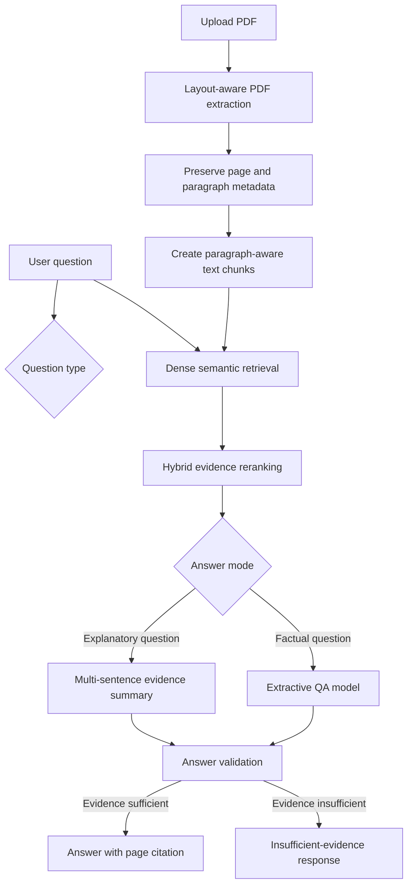
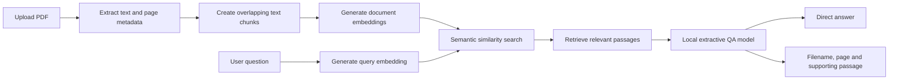

# Academic Research Assistant


A local, evidence-grounded PDF question-answering system built with Python,
FastAPI, Streamlit, sentence embeddings, cross-encoder reranking, and
transformer-based question answering.

Unlike a basic chatbot wrapper, the application processes document structure,
retrieves supporting evidence, distinguishes factual from explanatory questions,
and returns page-level citations without requiring a paid language-model API.


## Technical Highlights

- Layout-aware PDF extraction using PyMuPDF
- Page, paragraph, and source metadata preservation
- Paragraph-aware overlapping text chunking
- Dense semantic retrieval with Sentence Transformers
- Cross-encoder and lexical hybrid reranking
- Local extractive question answering with Transformers
- Multi-sentence evidence summaries for explanatory questions
- Definition-question and insufficient-evidence safeguards
- Page-level citations and supporting passages
- FastAPI backend and Streamlit frontend
- Automated testing and GitHub Actions continuous integration
- Reproducible retrieval, answer, citation, and refusal evaluation

## Evaluation

The application achieved the following results on a reproducible, controlled
10-question evaluation set:

| Metric | Result |
|---|---:|
| Retrieval Hit@3 | 100% |
| Answer accuracy | 100% |
| Citation accuracy | 100% |
| Unsupported-question refusal accuracy | 100% |
| Overall success rate | 100% |

These results apply only to the controlled evaluation set and are not presented
as general real-world accuracy. Additional testing with visually complex PDFs
revealed further limitations and guided subsequent improvements.

## System Architecture



## Failure-Driven Development

The system was improved through testing on real PDFs rather than only controlled
examples. During development, several failure modes were identified:

- The QA model selected a repeated question word such as “How.”
- Short but incomplete spans such as “in the water” were returned.
- Sidebar text was mixed with the main article body.
- Multi-column PDFs combined captions, headings, and unrelated sections.
- Related content was sometimes mistaken for a direct definition.
- Explanatory questions required multiple evidence sentences rather than one span.

These failures led to the implementation of question-echo filtering,
layout-aware extraction, paragraph-preserving chunking, heading detection,
definition guards, hybrid reranking, and separate factual and explanatory
answering modes.

## Overview

University students often work with long readings, lecture notes, and research papers. Finding a specific piece of information across these documents can be time-consuming.

The Academic Research Assistant allows a user to upload a PDF and ask a question about its contents. The application retrieves relevant passages, extracts a direct answer from the evidence, and returns the supporting filename and page number.

The system runs with open-source models and does not require a paid language-model API.

## Features

- Upload text-based PDF documents
- Extract text while preserving filenames and page numbers
- Divide documents into overlapping searchable chunks
- Generate sentence embeddings for document passages
- Perform semantic search using cosine similarity
- Extract direct answers using a local transformer model
- Return page-level citations and supporting passages
- Refuse questions when the available evidence is insufficient
- Use the application through a Streamlit web interface
- Access separate FastAPI search and answer endpoints
- Validate behaviour with 47 automated tests

## System Architecture



## How It Works

1. `pypdf` extracts text from each PDF page.
2. The text chunker divides pages into overlapping passages while preserving citation metadata.
3. `multi-qa-MiniLM-L6-cos-v1` converts passages and questions into normalized embedding vectors.
4. The semantic-search service compares vectors and ranks the most relevant passages.
5. `distilbert-base-cased-distilled-squad` extracts an answer directly from the retrieved evidence.
6. Confidence thresholds determine whether the application should answer or return an insufficient-evidence message.
7. The API returns the answer, retrieval score, answer score, source filename, page number, and supporting passage.

## Technology Stack

- Python
- FastAPI
- Streamlit
- PyTorch
- Hugging Face Transformers
- Sentence Transformers
- NumPy
- pypdf
- Pydantic
- Pytest

## Project Structure

```text
academic-research-assistant/
├── app/
│   ├── api/
│   │   └── documents.py
│   ├── services/
│   │   ├── answer_extractor.py
│   │   ├── answer_pipeline.py
│   │   ├── embedding_service.py
│   │   ├── pdf_extractor.py
│   │   ├── retrieval_pipeline.py
│   │   ├── semantic_search.py
│   │   └── text_chunker.py
│   └── main.py
├── assets/
│   └── demo.png
├── frontend/
│   └── streamlit_app.py
├── tests/
├── README.md
└── requirements.txt
```

## Installation

Clone the repository:

```bash
git clone https://github.com/alongholyalone-hue/academic-research-assistant.git
cd academic-research-assistant
```

Install the dependencies:

```bash
python -m pip install -r requirements.txt
```

The embedding and question-answering models are downloaded automatically during the first request.

## Running the Application

Start the FastAPI backend:

```bash
uvicorn app.main:app \
  --host 0.0.0.0 \
  --port 8000 \
  --reload
```

In a second terminal, start the Streamlit interface:

```bash
streamlit run frontend/streamlit_app.py \
  --server.address 0.0.0.0 \
  --server.port 8501
```

The FastAPI documentation is available at:

```text
http://127.0.0.1:8000/docs
```

The Streamlit interface is available at:

```text
http://127.0.0.1:8501
```

## API Endpoints

### `POST /documents/search`

Returns passages that are semantically related to the user's question.

### `POST /documents/answer`

Returns:

- A direct extracted answer
- Whether sufficient evidence was found
- Answer-extraction score
- Semantic-retrieval score
- Source filename
- Page number
- Supporting passage

## Example

Question:

```text
What does one plus one equal?
```

Document passage:

```text
The document states that one plus one equals 2.
```

Result:

```json
{
  "answered": true,
  "answer": "2",
  "citation": {
    "source": "example.pdf",
    "page_number": 1,
    "text": "The document states that one plus one equals 2."
  }
}
```

## Running the Tests

```bash
python -m pytest -q
```

The project currently contains 47 automated tests covering:

- API health endpoints
- PDF extraction
- Text normalization
- Text chunking and overlap
- Embedding validation
- Semantic result ranking
- Retrieval-pipeline integration
- Answer-span extraction
- Confidence and refusal thresholds
- PDF upload validation
- Search and answer API responses

## Responsible AI Design

The application is designed to reduce unsupported responses by:

- Using only the uploaded document as evidence
- Returning the supporting passage and page number
- Applying retrieval and answer-confidence thresholds
- Returning an insufficient-evidence message when thresholds are not met
- Preserving the original evidence separately from the cleaned answer

The confidence values are model-ranking scores and should not be interpreted as calibrated probabilities of correctness.

## Limitations

- Only text-based PDFs are supported; scanned PDFs require OCR.
- The answer must appear explicitly in the retrieved text.
- The extractive model cannot write long summaries or combine complex arguments across many pages.
- Confidence thresholds are heuristic and require further evaluation.
- Documents are processed again for each request.
- The application does not currently store documents or conversation history permanently.

## Future Improvements

- OCR support for scanned PDFs
- Persistent document collections
- Vector-database integration
- Multi-document search
- Retrieval and answer-quality evaluation
- Improved refusal calibration
- Conversation history
- Containerized deployment
- Optional generative-model integration

## Evaluation

The system was evaluated using a reproducible, controlled four-page PDF
containing eight answerable questions and two unsupported questions.

| Metric | Result |
|---|---:|
| Retrieval Hit@3 | 100% |
| Answer accuracy | 100% |
| Citation accuracy | 100% |
| Unsupported-question refusal accuracy | 100% |
| Overall success rate | 100% |

These results apply only to the controlled 10-question evaluation set and
should not be interpreted as general real-world accuracy.

See [evaluation/results.md](evaluation/results.md) for detailed results and
[evaluation/run_evaluation.py](evaluation/run_evaluation.py) for the
reproducible evaluation script.

## Purpose

This project was developed to strengthen my practical understanding of natural language processing, semantic retrieval, transformer models, API development, testing, and responsible AI system design.